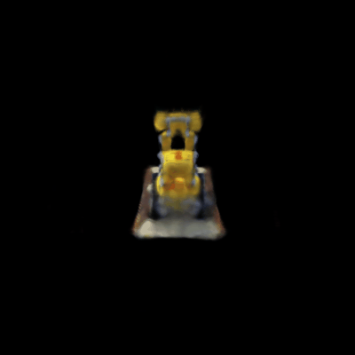
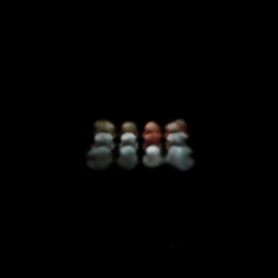
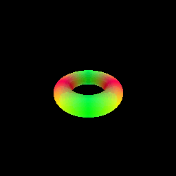
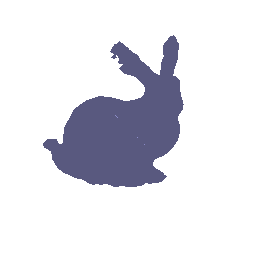

# Assignment 3

## A. Neural Volume Rendering 

### 0. Transmittance Calculation

### 1. Differentiable Volume Rendering

#### 1.5. Volume rendering

Volume Rendering Gif

Depth Visualization using Depth Map

### 2. Optimizing a basic implicit volume

#### 2.3. Visualization

Optimized volume gif

### 3. Optimizing a Neural Radiance Field (NeRF)

### 4. NeRF Extras

#### 4.1 View Dependence

Discuss the trade-offs between increased view dependence and generalization quality -

Results for High Resolution Lego Data

Results for High Resolution Materials Data

## B. Neural Surface Rendering

### 5. Sphere Tracing

Writeup describing your implementation - 

For each ray, I initialize a length equal to "self.near" and calculate the points on that ray as the ray_origin + length * ray_direction. Then, for each ray's point, I calculate the values of SDF and then increment the lengths of each ray with their respective length. I repeat this process arbitrary number of times. After the repetition, I calculate the final sdf values for each of the rays. If the sdf values are below the threshold, I mark that as a hit in the mask.

### 6. Optimizing a Neural SDF

| Input GIF | Final GIF|
|-----------|----------|
|||