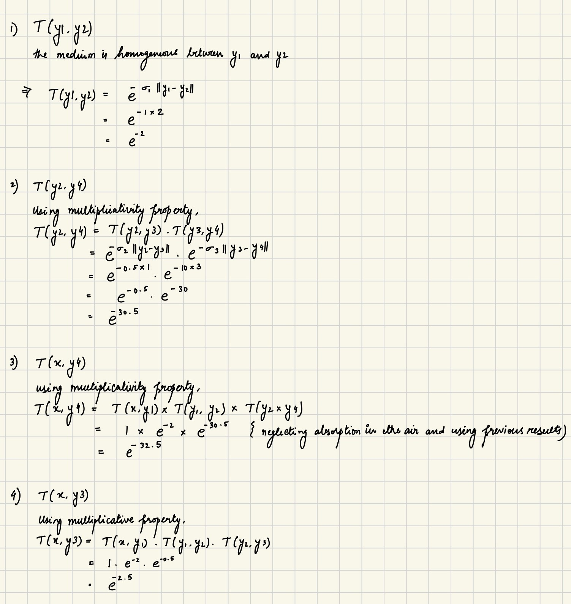
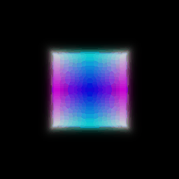
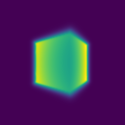
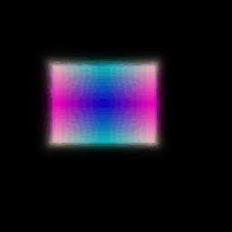
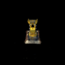

# Assignment 3

## A. Neural Volume Rendering 

### 0. Transmittance Calculation

### 1. Differentiable Volume Rendering

#### 1.5. Volume rendering

Volume Rendering Gif

Depth Visualization using Depth Map

### 2. Optimizing a basic implicit volume

#### 2.3. Visualization

Optimized volume gif

### 3. Optimizing a Neural Radiance Field (NeRF)

