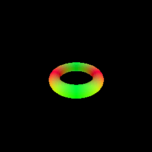

# Assignment 3

## A. Neural Volume Rendering 

### 0. Transmittance Calculation

### 1. Differentiable Volume Rendering

#### 1.5. Volume rendering

Volume Rendering Gif

Depth Visualization using Depth Map

### 2. Optimizing a basic implicit volume

#### 2.2 Loss and training 

Center of the box: (0.25, 0.25, 0.00)

Side lengths of the box: (2.01, 1.50, 1.50)

#### 2.3. Visualization

Optimized volume gif

### 3. Optimizing a Neural Radiance Field (NeRF)

### 4. NeRF Extras

#### 4.1 View Dependence

Discuss the trade-offs between increased view dependence and generalization quality -

Increasing view dependency makes the model learn the radiance for each points for the particular environment around the object in the training images. However, if the model is used to render images in a novel view, within a novel environment, the ground truth view dependent radiance of the object's points will change as per the environment. Since the new ground truth radiance has not been seen by the model, the model will use it's priors of radiance from the training environment. This will lead to inaccurate colouration of the object, leading to a loss of generality. 

Therefore, as we increase the view dependence of the model, the generalization ability of the model may decrease.

Results for High Resolution Lego Data

Results for High Resolution Materials Data

## B. Neural Surface Rendering

### 5. Sphere Tracing

Writeup describing your implementation - 

For each ray, I initialize a length equal to "self.near" and calculate the points on that ray as the ray_origin + length * ray_direction. Then, for each ray's point, I calculate the values of SDF and then increment the lengths of each ray with their respective length. I repeat this process arbitrary number of times. After the repetition, I calculate the final sdf values for each of the rays. If the sdf values are below the threshold, I mark that as a hit in the mask.

### 6. Optimizing a Neural SDF

| Input GIF | Final GIF|
|-----------|----------|
|||

### 7. VolSDF

Effect of alpha: 
It scales the magnitude of the density field around the object.

Effect of Beta:
It controls the sharpness of the object since it determines how quickly or gradually the value of density changes for a ray moving towards the surface of the object.

1. How does high beta bias your learned SDF? What about low beta?
High beta makes the change in the sdf smoother, in the direction normal to the object surface. However a lower beta, makes the change in sdf sharper along the direction of normal to the object surface. Therefore, having lower beta makes the losses higher and makes the network more closely model the object's surface. On the other hand, higher beta prevents the model from overfitting and reduces bias.

2. Would an SDF be easier to train with volume rendering and low beta or high beta? Why?
High beta. This is because having higher beta will increase the density values of the points around the surface but outside the object. This will allow more points sampled along the ray to have non zero densities. This will lead to more dense gradients and better training of the network.

3. Would you be more likely to learn an accurate surface with high beta or low beta? Why?
Low beta would allow me to learn a more accurate surface. This is because a stricter occupancy signal will force the model to learn the sharp transitions around the surface boundary of the object. A higher beta would have made the density gradients smoother and led to the model learning smooth and blurry boundary.

### 8. Neural Surface Extras

#### 8.2 Fewer Training Views

VOLSDF -

| Geometry | Render|
|-----------|----------|
|||

NeRF -

